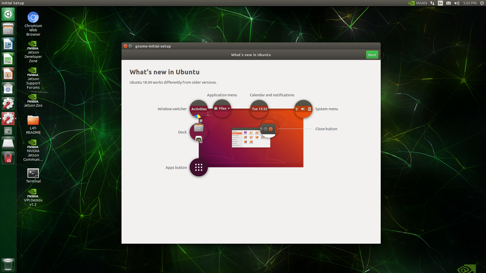
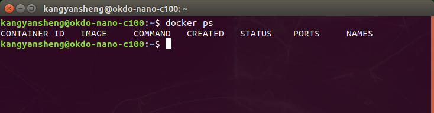
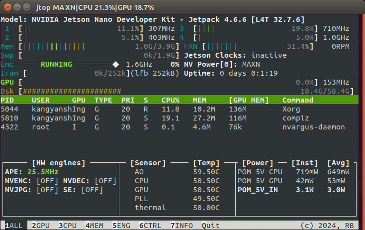
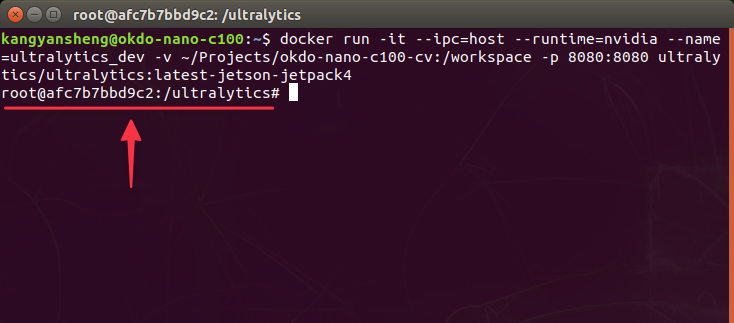
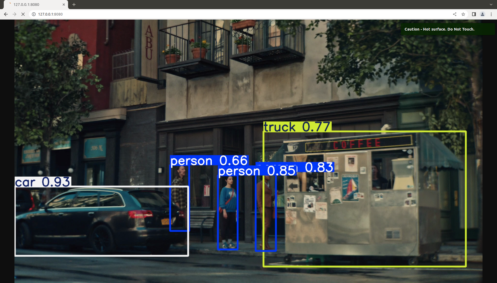

# Okdo Nano C100 — Computer Vision Getting Started Guide

A step-by-step guide to running object detection using [Ultralytics YOLO26](https://docs.ultralytics.com/models/yolo26) on the Okdo Nano C100 development board, with a live preview served over HTTP.

## Project Structure

```
okdo-nano-c100-cv/
├── assets              # Assets for README.md
├── bus.jpg             # Image source
├── commercial.mp4      # Video source
├── inference.py        # Main inference and streaming script
├── yolo26n.pt          # YOLO26n model weights
└── README.md           # This file
```

## Table of Contents

- [Requirements](#requirements)
- [1. Flash JetPack Image](#1-flash-jetpack-image)
- [2. Initial Board Setup](#2-initial-board-setup)
- [3. Verify Docker](#3-verify-docker)
- [4. Install Jetson Stats](#4-install-jetson-stats)
- [5. Clone Repository](#5-clone-repository)
- [6. Run Docker Container](#6-run-docker-container)
- [7. Run Inference](#7-run-inference)
- [8. View Live Stream](#8-view-live-stream)
- [9. Stopping and Cleaning Up](#9-stopping-and-cleaning-up)

## Requirements

- Okdo Nano C100 Development Kit
- MicroSD card (32GB or larger recommended)
- A machine with [Raspberry Pi Imager](https://www.raspberrypi.com/software/) installed
- Monitor, keyboard, and mouse
- Network connection (ethernet)

## 1. Flash JetPack Image

1. Download the JetPack image for the Okdo Nano C100 from [here](https://auto.designspark.info/okdo_images/c100.img.xz).
2. Open **Raspberry Pi Imager** on your machine.
3. Select the downloaded image and your MicroSD card as the target.
4. Flash and wait for it to complete.
5. Insert the MicroSD card into the board.

[INSERT VIDEO HERE]

## 2. Initial Board Setup

1. Connect your monitor, keyboard, and mouse to the board.
2. Power on the board.
3. Follow the on-screen setup (accept the license agreements, select language and region, create a user account, select power mode, etc.).

[INSERT VIDEO HERE]

4. Wait for the board to boot to the desktop.

<p align="center">
    
</p>

## 3. Verify Docker

Open a terminal and confirm Docker is available:

```bash
docker --version
```

Docker comes pre-installed with JetPack — no additional installation is needed. You should see the version of docker returned in the terminal after running the command. 

### Run Docker Without sudo

By default, Docker requires `sudo` to run. To allow your user to run Docker commands without it, add your user to the `docker` group:

```bash
sudo usermod -aG docker $USER
```

Then log out and log back in, or reboot the board for the change to take effect system-wide:

```bash
sudo reboot
```

Verify it works after rebooting:

```bash
docker ps
```

<p align="center">
    
</p>

## 4. Install Jetson Stats

`jetson-stats` provides `jtop`, a system monitoring tool for Jetson boards. It gives a real-time overview of CPU, GPU, RAM, and power usage — useful for keeping an eye on resource consumption while running inference.

Update package list:

```bash
sudo apt update
```

Install `pip` (Python package manager):

```bash
sudo apt install python3-pip
```

Install `jetson-stats` using pip:

```bash
sudo -H pip3 install -U jetson-stats
```

Then reboot for it to take effect:

```bash
sudo reboot
```

Once rebooted, run it with:

```bash
jtop
```

<p align="center">
    
</p>

To exit, simply press `q` in the terminal.

## 5. Clone Repository

Create a project directory and clone this repository:

```bash
mkdir ~/Projects
cd ~/Projects
git clone https://github.com/yanshengk/okdo-nano-c100-cv.git
cd okdo-nano-c100-cv
```

## 6. Run Docker Container

Start the Ultralytics container with the project directory mounted and port 8080 exposed:

```bash
docker run -it \
  --ipc=host \
  --runtime=nvidia \
  --name=ultralytics_dev \
  -v ~/Projects/okdo-nano-c100-cv:/workspace \
  -p 8080:8080 \
  ultralytics/ultralytics:latest-jetson-jetpack4
```

| Flag | Purpose |
|---|---|
| `--ipc=host` | Shares host shared memory, prevents PyTorch memory errors |
| `--runtime=nvidia` | Enables GPU access inside the container |
| `--name=ultralytics_dev` | Names the container for easy reference |
| `-v` | Mounts your project folder into `/workspace` inside the container |
| `-p 8080:8080` | Exposes port 8080 for the HTTP stream |

After running the command, your terminal will be inside the container. You will see `root@<random_string>:/ultralytics#` instead of your username and hostname in the terminal. 

<p align="center">
    
</p>

Your project files are available at `/workspace` in the container.

## 7. Run Inference

In the container, navigate to the `/workspace` and run the inference script:

```bash
cd /workspace
/usr/bin/python3 inference.py
```

> Use `/usr/bin/python3` explicitly — the Ultralytics libraries are installed under this interpreter.

You should see the following output:

```
Loading model...
Model loaded.
Stream running at http://127.0.0.1:8080
Press Ctrl+C to stop.
```

## 8. View Live Stream

Open a browser on the board and navigate to this address to view the inference output:

```
http://127.0.0.1:8080
```

<p align="center">
    
</p>

## 9. Stopping and Cleaning Up

**Stop the inference script:**

Press `Ctrl + C` in the terminal where the script is running.

**Exit the container:**

```bash
exit
```

**Remove the container:**

```bash
docker rm ultralytics_dev
```

> Removing the container does not delete your project files — they are stored in the project folder on the host and persist independently.
